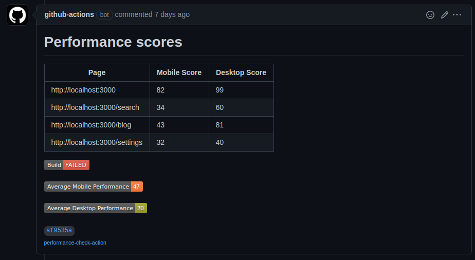

# Performance Check Action

A Github action to audit the performance of a web application within a CICD pipeline using Google Lighthouse. 
This action takes a list of URLs and audits their performance multiple times, for both desktop and mobile devices. 

Once the audit has been completed, a comment will be added to the PR (if in the context of a PR):




This action has the following parameters:
* `repo-token` _(required)_: The token for this Github repo so that the action can interact with any PRs. Populate this using `${{ secrets.GITHUB_TOKEN }}` in your workflow file.
* `urls` _(required)_: A list of URLs/endpoints that the action should audit for performance.
* `iterations` _(optional - default: 5)_: The number of times that each endpoint should be audited. See the note on variance below.
* `minimum-desktop-score` _(optional - default: 80)_: The threshold that must be met by all desktop performance audits or else the check will fail.
* `minimum-mobile-score` _(optional - default: 80)_: The threshold that must be met by all mobile performance audits or else the check will fail.

### Variance

Due to a number of factors, the performance score for a webpage can vary slightly between runs. One way to account for this is to run the audit multiple times - specified by the `iterations` parameter - and take the median result. See the [documentation on variance](https://github.com/GoogleChrome/lighthouse/blob/master/docs/variability.md) for more details.

### Development vs Production builds

It is recommended that you test a production build of your application for the most accurate results - running the server in development mode can have a significant impact on performance.

## Usage

Example `.github/workflows/performance-check.yml` file

```yml 
name: Run performance check using Google Lighthouse
on:
  pull_request:
  workflow_dispatch:

jobs:
  performance-check:
    runs-on: ubuntu-latest
    steps:
      - name: Check out the application's source code
        uses: actions/checkout@v2

      - name: Install node
        uses: actions/setup-node@v1
        with:
          node-version: 14

      - name: Install application dependencies
        run: npm ci

      - name: Build the application
        run: npm run build

      - name: Run the application in the background
        run: (npm start &)

      - name: Wait for the application to start
        run: sleep 5

      - name: Check Lighthouse performance score
        uses: university-of-york/esg-action-performance-check@v1
        with:
          repo-token: ${{ secrets.GITHUB_TOKEN }}
          iterations: 7
          minimum-desktop-score: 90
          minimum-mobile-score: 80
          urls: |
            http://localhost:3000
            http://localhost:3000/search
            http://localhost:3000/blog
            http://localhost:3000/settings
            
      - name: Upload performance reports as artifact
        uses: actions/upload-artifact@v2
        if: ${{ always() }} #Upload reports even if the check fails
        with:
          name: reports
          path: ./reports
```
